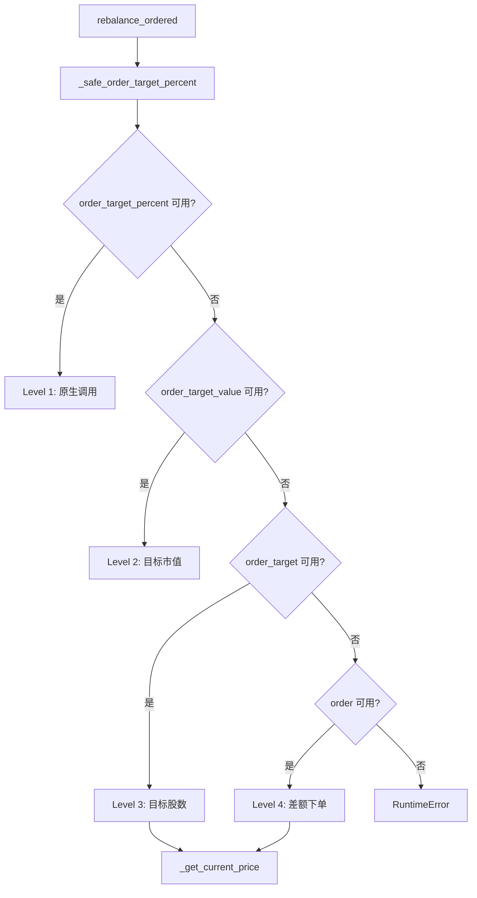

## 用户需求

聚宽量化平台的 standalone 策略代码在回测引擎 `jqboson` 中运行时报错：

```
NameError: name 'order_target_percent' is not defined
```

错误发生在 `rebalance_ordered` 函数中调用 `order_target_percent(code, weight)` 时。聚宽引擎注入了 `log`、`get_fundamentals`、`set_benchmark` 等函数，但未将交易函数 `order_target_percent` 注入到用户代码全局命名空间，导致裸调用时 NameError。

## 产品概述

为三个 standalone 策略文件添加「聚宽交易 API 兼容垫片」层，使策略在聚宽引擎无论注入哪一层级交易函数时都能正常调仓下单，消除 NameError。

## 核心功能

- 新增 `_resolve_jq_func(name)` 函数，安全解析聚宽注入的全局交易函数
- 新增 `_safe_order_target_percent(context, code, weight)` 降级链下单封装，优先使用聚宽原生 `order_target_percent`，逐级降级到 `order_target_value`、`order_target`、`order`
- 将三个 standalone 文件中 `rebalance_ordered` 内的裸调用替换为垫片调用
- 全部交易函数不可用时抛出明确的 RuntimeError（而非 NameError），提示需在聚宽回测环境运行

## 技术栈

- 语言：Python 3（聚宽策略环境）
- 运行平台：JoinQuant（聚宽）jqboson 回测引擎
- 无外部依赖，纯聚宽内置 API

## 实现方案

### 根因

聚宽 `jqboson` 引擎在用户代码全局命名空间中注入了数据/日志/配置类函数（`log`、`get_fundamentals`、`set_benchmark` 等），但交易函数 `order_target_percent` 的注入在不同引擎模式下存在差异。策略代码直接裸调用该函数，无降级路径，注入缺失即 NameError。

### 修复策略：兼容垫片 + 降级链

在 imports 之后（约 line 34 注释块后）、策略函数之前新增兼容垫片区块，包含三个工具函数：

1. **`_resolve_jq_func(name)`**：从 `globals()` → `builtins` 逐层查找聚宽注入的全局函数，找不到返回 `None`（不抛异常）。

2. **`_get_current_price(code, date_str)`**：通过聚宽 `get_price` 获取最新收盘价，供降级方案手动计算目标股数。复用策略已有 `get_price` 调用模式（`skip_paused=False`）。

3. **`_safe_order_target_percent(context, code, weight)`**：降级链下单封装，优先级：

- **Level 1**：聚宽原生 `order_target_percent(code, weight)` — 完整语义，最优
- **Level 2**：`order_target_value(code, total_value × weight)` — 目标市值等价
- **Level 3**：`order_target(code, target_shares)` — 手动算目标股数（整手处理：`int(total_value×weight/price/100)×100`）
- **Level 4**：`order(code, delta_shares)` — 与当前持仓差额下单
- **全不可用**：抛 `RuntimeError("聚宽交易函数均未注入，请确认在聚宽回测环境中运行")`

### 调用点替换（三个文件相同）

- 卖出清仓：`order_target_percent(code, 0)` → `_safe_order_target_percent(context, code, 0)`
- 买入建仓：`order_target_percent(code, weight)` → `_safe_order_target_percent(context, code, weight)`

`rebalance_ordered` 已持有 `context` 参数，直接传入即可。

## 实现说明

- **降级开销**：降级路径仅在原生函数缺失时触发，正常聚宽环境走 Level 1，零额外开销。Level 3/4 需额外调用 `get_price` 取价，仅在降级场景发生，非热路径。
- **整手处理**：A 股最小交易单位为 100 股，`int(total_value×weight/price/100)×100` 保证合规。
- **错误可读性**：RuntimeError 替代 NameError，错误信息明确，便于排查环境问题。
- **不影响范围**：`simulate_limit_order` 涨跌停撮合逻辑、`apply_cost_model` 成本模型、`calculate_ev_factor` 因子计算、`initialize`/`rebalance` 主流程均不变。
- **data_layer.py 不修改**：库版本已标注 `# type: ignore[name-defined]`，用于本地静态分析，非用户直接运行文件。

## 架构设计



## 目录结构

三个 standalone 策略文件结构完全一致，修改内容相同：

```
joinquant/strategies/
├── P1-F1-EV-2026Q2-v1-AllA-standalone.py   # [MODIFY] 新增兼容垫片 + 替换调用点
├── P1-F1-EV-2026Q2-v1-CSI300-standalone.py # [MODIFY] 同上
└── P1-F1-EV-2026Q2-v1-CSI500-standalone.py # [MODIFY] 同上
```

### 各文件修改详情

**新增内容**（插入位置：imports 之后、`# 一、股票池` 之前，约 line 35 处）：

- `_resolve_jq_func(name)`：安全解析聚宽全局函数，globals → builtins 逐层查找
- `_get_current_price(code, date_str)`：通过 get_price 获取收盘价，供降级计算
- `_safe_order_target_percent(context, code, weight)`：降级链下单封装，4 级降级 + RuntimeError 兜底

**替换内容**（`rebalance_ordered` 函数内，三文件相同行号）：

- Line 143：`order_target_percent(code, 0)` → `_safe_order_target_percent(context, code, 0)`
- Line 154：`order_target_percent(code, weight)` → `_safe_order_target_percent(context, code, weight)`